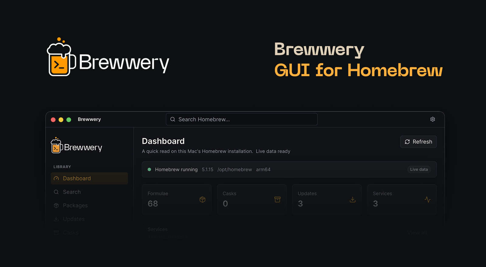

  

<h1 align="center">🍺 Brewwery</h1>

  <strong>A visual Homebrew manager for macOS.</strong>

  <a href="https://www.brewwery.com">Website</a>
  ·
  <a href="https://github.com/brewwery/brewwery">GitHub</a>
  ·
  <a href="https://github.com/brewwery/brewwery/issues">Issues</a>

---

## What is Brewwery?

**Brewwery** is an open-source macOS desktop app for managing Homebrew packages, casks, services, updates, cleanup, diagnostics, and Brewfiles from one clean visual interface.

It is built for developers who want a safer and more comfortable way to inspect, maintain, and understand their local macOS environment.

## Features

- Browse installed formulae and casks
- Search and inspect Homebrew packages
- Check outdated packages and apply upgrades
- Manage Homebrew services
- Preview and run cleanup safely
- Run `brew doctor` and inspect diagnostics
- Export and manage Brewfiles
- View Homebrew prefix, version, architecture, and system info
- Open Terminal from the current context

## Stack

| Layer | Technology |
|---|---|
| Frontend | React · TypeScript · Vite · Tailwind CSS · shadcn/ui |
| Desktop shell | Electron |
| System core | Rust · napi-rs |
| State | Zustand |
| License | MIT |

---

  Open source. Built for macOS developers.

